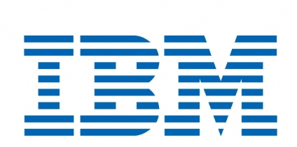

<div align="center">
  
</div>

# Wifi Automations - AP count based on Severity

## Overview
IBM SevOne NPM provides Wifi monitoring solutions out-of-the-box. This add-on provides additional automation features to enhance the Wifi Monitoring solution and provide customer with enhanced information and visualizations.

## Solution

### Device Count with Alerts under Device Groups
In IBM SevOne NPM, devices can be grouped under multiple device groups.
If there are any alerts on any of the devices, Data Insight provides a count of the number of alerts under each device group / device.
However, OOTB, there is no current feature to detail the count of devices with Alerts and their max severity - under each device group.

This automation
- Counts the number of devices under the configured device group and its sub device groups
- Determines the number of devices with Alerts [ and its maximum severity ] under the configured device group and its sub device groups
- Creates a synthetic device - 'Severity-AP-Count' with IP - '9.9.9.9' - Both of which can be configured in the configuration file
- Creates multiple objects under this synthetic device - One object per device Group being monitored.
- Under each object, creates multiple indicators, which shows the total number of devices, number of devices with Alerts [ segregated according to Severity ]


## Table of Contents

- [Prerequisites](#prerequisites)
- [Installation](#installation)
- [Maintanance](#maintanance)
- [Verification](#Verification)


## Prerequisites

Before you begin, ensure you have met the following requirements:

1. SevOne V3 APIs credentials [ Tested for SevOne 6.7 and 6.8 ].
2. Parent Device group Paths to be monitored


## Installation

To install this project, follow these steps:

1. Create a directory ~/ps-di-selfmon on the cluster master of the SevOne cluster.
2. Download the RPM  ibm-el-wifi-automations-<version>-1.x86_64.rpm to the ~/ps-di-selfmon directory
3. Install the RPM
    ```sh
    dnf install ibm-el-wifi-automations-<version>-1.x86_64.rpm
    ```
4. Update `/var/custom/ps-addon/el-wifi-automations/etc/config.json` to include your SevOne API credentials,
   You can use 'UseSShKeys = 1' to use sshKeys to login. If not, you can set 'sshPassword'
   ```json
    {
        "ApplianceDetails": [
        {
            "IPAddress": "<ClusterMaster IP Address>",
            "UserName": "<API username",
            "Password": "<API password>",
            "sshUserName": "<ssh userName>", # Required
            "sshPassword": "<ssh Password>", # To be set only if UseSSHKeys = 0
            "UseSShKeys": 1, # Can take value 0 or 1
            "Type": "NMS"
        }
        ]
    }
    ```
    ```json
        "DIDetails": [
        {
            "IPAddress": "<IPAddress>",
            "UserName": "datainsight",
            "Password": "datainsight",
            "Type": "Prometheus",
    ```
     ```json
            {
            "Name": "Severity-AP-Count", # Synthetic device name
            "IPToBeCreated": "9.9.9.9", # Synthetic device IP
            "Enabled": 1,
            "ParentDeviceGroup": [
                "All Device Groups/AP",
                "All Device Groups/Wifi/WLCs"
            ], # List of device groups to be monitored
            "AlertSeverityDict": {
                "CLEAR": 0,
                "DEBUG": 1,
                "INFO": 2,
                "NOTICE": 3,
                "WARNING": 4,
                "ERROR": 5,
                "CRITICAL": 6,
                "ALERT": 7,
                "EMERGENCY": 8
            }, # Severity List, Need not be changed
            "AlertMonitoringStartTime": 0,
            "Plugin": "DEFERRED"
        }
    ```
    ```json
    "LogLevel": "INFO",
    "MaxLogFileSize": "10485760",
    ```
5. Run the following command to run the add-on on the Cluster master 
    Install: 
    ```sh
    /var/custom/ps-addon/el-wifi-automations/bin/run-wifi-automations.sh
    ```

6. To automate the add-on to run it at particular intervals, add the below entry into the cron
    ```sh
    /etc/cron.d/el-wifi-automations
    ```
    ```sh
    # Global variables
    SHELL=/bin/bash
    PATH=/sbin:/bin:/usr/sbin:/usr/bin
    MAILTO=""
    HOME=/
    PHPRC=/config/php.d/php-cli.ini
    SNMPCONFPATH=/config/snmp
    MYSQL_HOME=/config
    */5 * * * * root /bin/bash /var/custom/ps-addon/el-wifi-automations/bin/run-wifi-automations.sh >> /var/custom/ps-addon/el-wifi-automations/log/el-wifi-automation.log 2>&1
    ```
    ```sh
    chmod 644 /etc/cron.d/el-wifi-automations
    ```


## Maintanance

1. To run the add-on, execute the following command:

    ```sh
    /var/custom/ps-addon/el-wifi-automations/bin/run-wifi-automations.sh
    ```
    This will run the add-on 

2. To stop the add-on, execute the following command:

    Remove the cron entry
     ```sh
    /etc/cron.d/el-wifi-automations
    ```
    ```sh
    # Global variables
    SHELL=/bin/bash
    PATH=/sbin:/bin:/usr/sbin:/usr/bin
    MAILTO=""
    HOME=/
    PHPRC=/config/php.d/php-cli.ini
    SNMPCONFPATH=/config/snmp
    MYSQL_HOME=/config
    */5 * * * * /bin/bash /var/custom/ps-addon/el-wifi-automations/bin/run-wifi-automations.sh >> /var/custom/ps-addon/el-wifi-automations/log/el-wifi-automation.log 2>&1
    ```


    And run the below command to stop the pod and remove the container.
    ```sh
    /var/custom/ps-addon/el-wifi-automations/bin/stop-wifi-automations.sh
    ```
    This will stop the add-on

3. To Verify when the cron last ran the job, please use the below command
   ```sh
    grep el-wifi-automations /var/log/cron
    ```


## Verification

To verify if the application is running fine

1. Check if the docker container is running
    ```sh
    podman ps -f name=el-wifi-automations
    ```
    The container will be running only for the time the application is executing. The container exits once the add-on completes the execution.


2.  Check the log files at
    ```sh
    /var/custom/ps-addon/el-wifi-automations/log/el-wifi-automation.log
    ```

3.  Check if the metrics are being ingested

    - Login to SevOne NPM  - Device Manager
    - Check for device with IP : 9.9.9.9 [ or the value configured in config.json ]
    - Review the Objects [ One object per device group ]
    - Review the metrics under each object [ No of devices segregated based on Max Severity of the alerts it has ]

